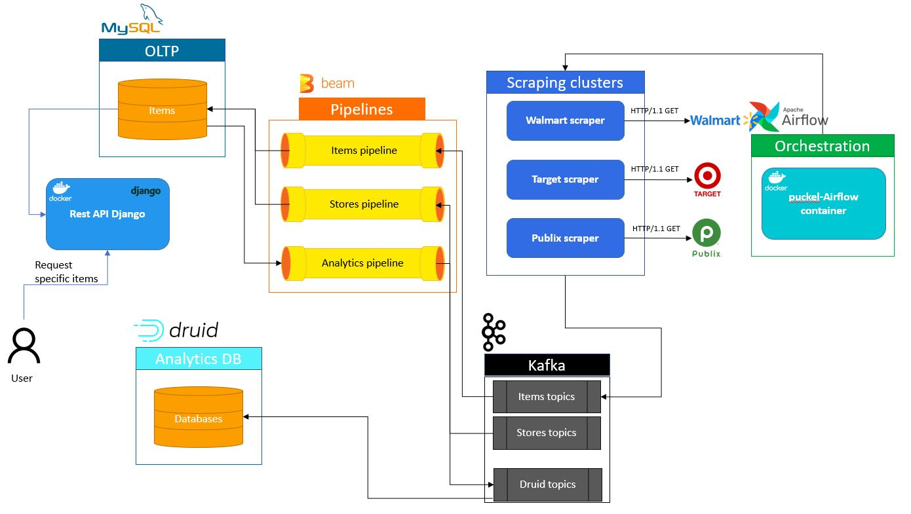

# Introduction
This project is a sample project to showcase basic data engineering skills. The subject matter is discussed a little bit later.

Demonstrated skills include: streaming data, batch data analysis, data transformation, data scraping, database modelling, and more.

## Motivation
My biggest motivation was building an end-to-end pipeline that I could display my data engineering skills with.

One of my biggest pet peeves when going grocery shopping was not knowing how much money I would be spending on groceries.
I always wanted to know how much a recipe would cost me to make. Sure I could ballpark it, but sometimes I would have to buy
another container of spice, and that would increase my bill. Or sometimes I wouldn't know which store had the best deals
on certain items. This made me think that maybe it would be interesting to build a project that helped me solve this problem.

## Architecture
The following image shows the architecture used to accomplish the end-to-end pipeline

## Technologies
All components listed below use Docker so that the environment is stable from one machine to another.
### Flask
A REST API, created in Flask, is used to "kick off" the pipeline. By querying certain endpoints with certain parameters,
a request is sent to a grocery store's website to get data for that store's grocery "type" (i.e., "apples", "chocolate", etc...)
### Airflow
Airflow is used to automatically request our local REST API to search for certain items. This keeps the items' prices updated as well as
whether or not the items are in stock at a store. A "cold-start" was used for querying items. A list of common searchable
grocery items was created at the beginning of the project. This list could be updated based on what people query the MySQL database for.
A smart method could be for the Airflow job to update certain items more frequently based on their usage/searches in the MySQL database.
### Kafka
Kafka is used as the main communication between services such as the Flask container and a Beam pipeline. It is also used
as the source for the Druid sink with data also coming from a Beam pipeline.
### MySQL
MySQL 8 is used to store data persistently. More indepth information can be found on that page
### Flink/Beam
Apache Beam pipelines are used to parse raw data from the Flask container and store it into the MySQL database. Beam pipelines
are also used to push analytic data, transformed from the MySQL database, to Apache Kafka to be stored in the Druid database.

Beam pipelines are run on Apache Flink.
### Druid
Druid is used to house historical and analytic grocery data. This data also includes the raw data from the MySQL database.

## Requirements
- [Java 8](https://www.java.com/en/download/manual.jsp) -- You can use OpenJDK as well if you prefer that on Linux distros
- [Gradle 6.3+](https://gradle.org/releases/#6.3) -- There is no guarantee any major versions (5, 7, etc...) will work
- [Docker](https://docs.docker.com/engine/install/) -- Install the main Docker engine
    - [Docker-compose](https://docs.docker.com/compose/install/) -- Install Docker-compose. On Windows this should be done automatically with Docker Desktop install
- [Python 3.8](https://www.python.org/downloads/release/python-380/) -- Install Python 3.8. This version comes with a required Pip version for Airflow
