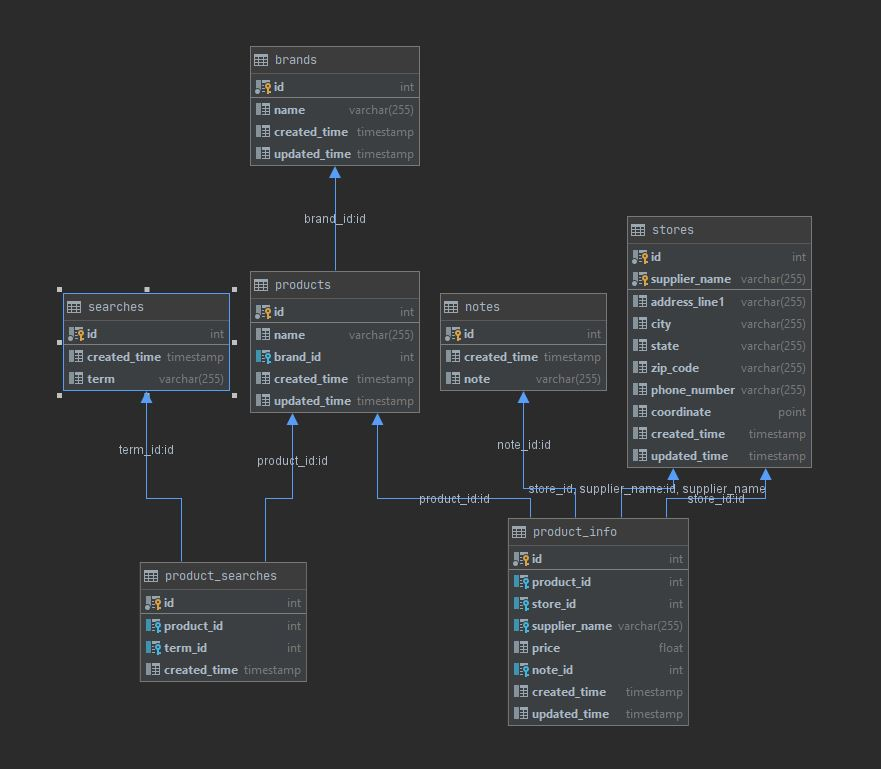

# Introduction
The following document describes the database schema. An ERD is given below as well to visualize relationships between
the different tables.

# Tables
## brands
### Description
Contains the brands that have been seen. Primary key **id** is a foreign key of the [product_info](#product_info) table.

### Schema
+--------------+--------------+------+-----+-------------------+-----------------------------------------------+
| Field        | Type         | Null | Key | Default           | Extra                                         |
+--------------+--------------+------+-----+-------------------+-----------------------------------------------+
| id           | int          | NO   | PRI | NULL              | auto_increment                                |
| name         | varchar(255) | YES  |     | NULL              |                                               |
| created_time | timestamp    | YES  |     | CURRENT_TIMESTAMP | DEFAULT_GENERATED                             |
| updated_time | timestamp    | YES  |     | CURRENT_TIMESTAMP | DEFAULT_GENERATED on update CURRENT_TIMESTAMP |
+--------------+--------------+------+-----+-------------------+-----------------------------------------------+

## notes
### Description
Stores any notes related to some product. This is currently not used, but may be helpful in the future for "promotions"
or something similar.

### Schema
+--------------+--------------+------+-----+-------------------+-------------------+
| Field        | Type         | Null | Key | Default           | Extra             |
+--------------+--------------+------+-----+-------------------+-------------------+
| id           | int          | NO   | PRI | NULL              | auto_increment    |
| created_time | timestamp    | YES  |     | CURRENT_TIMESTAMP | DEFAULT_GENERATED |
| note         | varchar(255) | YES  |     | NULL              |                   |
+--------------+--------------+------+-----+-------------------+-------------------+

## product_info
### Description
The "main" table that contains all pertinent information to a product entry. Notes are always `null` at the time of this
writing.

### Schema
+---------------+--------------+------+-----+-------------------+-----------------------------------------------+
| Field         | Type         | Null | Key | Default           | Extra                                         |
+---------------+--------------+------+-----+-------------------+-----------------------------------------------+
| id            | int          | NO   | PRI | NULL              | auto_increment                                |
| product_id    | int          | YES  | MUL | NULL              |                                               |
| store_id      | int          | YES  | MUL | NULL              |                                               |
| supplier_name | varchar(255) | YES  |     | NULL              |                                               |
| price         | float        | YES  |     | NULL              |                                               |
| note_id       | int          | YES  | MUL | NULL              |                                               |
| created_time  | timestamp    | YES  |     | CURRENT_TIMESTAMP | DEFAULT_GENERATED                             |
| updated_time  | timestamp    | YES  |     | CURRENT_TIMESTAMP | DEFAULT_GENERATED on update CURRENT_TIMESTAMP |
+---------------+--------------+------+-----+-------------------+-----------------------------------------------+

## product_searches
### Description
The product search table is a linking table between the [products](#products) table and the [searches](#searches) table. This
provides a way to query for an item by a search term.

### Schema
+--------------+-----------+------+-----+-------------------+-------------------+
| Field        | Type      | Null | Key | Default           | Extra             |
+--------------+-----------+------+-----+-------------------+-------------------+
| id           | int       | NO   | PRI | NULL              | auto_increment    |
| product_id   | int       | YES  | MUL | NULL              |                   |
| term_id      | int       | YES  | MUL | NULL              |                   |
| created_time | timestamp | YES  |     | CURRENT_TIMESTAMP | DEFAULT_GENERATED |
+--------------+-----------+------+-----+-------------------+-------------------+

## products
### Description
The products table contains a row for every product/brand combination.

### Schema
+--------------+--------------+------+-----+-------------------+-----------------------------------------------+
| Field        | Type         | Null | Key | Default           | Extra                                         |
+--------------+--------------+------+-----+-------------------+-----------------------------------------------+
| id           | int          | NO   | PRI | NULL              | auto_increment                                |
| name         | varchar(255) | YES  |     | NULL              |                                               |
| brand_id     | int          | YES  | MUL | NULL              |                                               |
| created_time | timestamp    | YES  |     | CURRENT_TIMESTAMP | DEFAULT_GENERATED                             |
| updated_time | timestamp    | YES  |     | CURRENT_TIMESTAMP | DEFAULT_GENERATED on update CURRENT_TIMESTAMP |
+--------------+--------------+------+-----+-------------------+-----------------------------------------------+

## searches
### Description
Contains all the search terms that were used to query the grocery website.

### Schema
+--------------+--------------+------+-----+-------------------+-------------------+
| Field        | Type         | Null | Key | Default           | Extra             |
+--------------+--------------+------+-----+-------------------+-------------------+
| id           | int          | NO   | PRI | NULL              | auto_increment    |
| created_time | timestamp    | YES  |     | CURRENT_TIMESTAMP | DEFAULT_GENERATED |
| term         | varchar(255) | YES  |     | NULL              |                   |
+--------------+--------------+------+-----+-------------------+-------------------+

## stores
### Description
Contains information related to stores, including location and address.

### Schema
+---------------+--------------+------+-----+-------------------+-----------------------------------------------+
| Field         | Type         | Null | Key | Default           | Extra                                         |
+---------------+--------------+------+-----+-------------------+-----------------------------------------------+
| id            | int          | NO   | PRI | NULL              |                                               |
| supplier_name | varchar(255) | NO   | PRI | NULL              |                                               |
| address_line1 | varchar(255) | YES  |     | NULL              |                                               |
| city          | varchar(255) | YES  |     | NULL              |                                               |
| state         | varchar(255) | YES  |     | NULL              |                                               |
| zip_code      | varchar(255) | YES  |     | NULL              |                                               |
| phone_number  | varchar(255) | YES  |     | NULL              |                                               |
| coordinate    | point        | YES  |     | NULL              |                                               |
| created_time  | timestamp    | YES  |     | CURRENT_TIMESTAMP | DEFAULT_GENERATED                             |
| updated_time  | timestamp    | YES  |     | CURRENT_TIMESTAMP | DEFAULT_GENERATED on update CURRENT_TIMESTAMP |
+---------------+--------------+------+-----+-------------------+-----------------------------------------------+